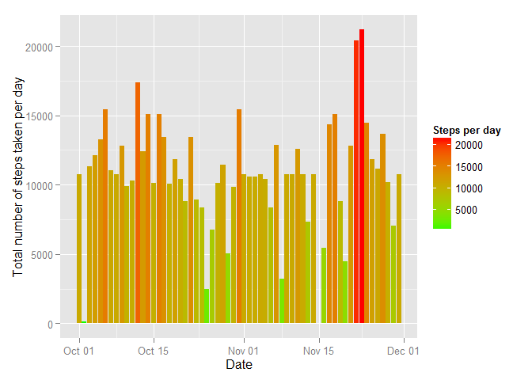

# Reproducible Research: Peer Assessment 1
Following libraries are needed to reproduce the research:

```r
library (downloader)
```

```
## Warning: package 'downloader' was built under R version 3.1.3
```

```r
library (ggplot2)
```

```
## Warning: package 'ggplot2' was built under R version 3.1.3
```

```r
library (data.table)
library (plyr)
```

## Loading and preprocessing the data


```r
unzip ("activity.zip")
data <- read.csv ("activity.csv")
data$date = as.Date (data$date) 
data <- data.table(data)
```

## What is mean total number of steps taken per day?

Calculate the total number of steps taken per day:

```r
StepsPerDay <- data [, list (DaySteps = sum (steps, na.rm = TRUE)), 
                     keyby="date"]
```

Make a **histogram** of the total number of steps:

```r
ggplot (StepsPerDay, aes (x = DaySteps)) + 
  geom_histogram () +
  labs (x = "Total number of steps taken per day", 
        y = "Frequency") 
```

 

Make a special histogram of the total number of steps taken **each** day:

```r
ggplot (StepsPerDay, aes (x = date, y = DaySteps)) + 
  geom_histogram (aes (fill = DaySteps), stat="identity") +
  scale_fill_gradient ("Steps per day", low = "green", high = "red") +
  labs (x = "Date", y = "Total number of steps taken per day") 
```

 

Calculate and report the mean and median of the total number of steps taken per day:

```r
mean (StepsPerDay$DaySteps, na.rm = TRUE)
```

```
## [1] 9354.23
```

```r
median (StepsPerDay$DaySteps, na.rm = TRUE)
```

```
## [1] 10395
```

## What is the average daily activity pattern?
Make a time series plot of the 5-minute interval (x-axis) and the average number of steps taken, averaged across all days (y-axis):

```r
DailyActivity <- data [, list (Average = mean (steps, na.rm = TRUE)), 
                       keyby="interval"]
ggplot (DailyActivity, aes (x = interval, y = Average)) + 
  geom_line () +
  labs (x = "Interval", y = "Average number of steps taken (across all days)")
```

 

Which 5-minute interval, on average across all the days in the dataset, contains the maximum number of steps?

```r
DailyActivity [Average == max (DailyActivity$Average), ]
```

```
##    interval  Average
## 1:      835 206.1698
```

## Imputing missing values

Calculate and report the total number of missing values in the dataset (i.e. the total number of rows with NAs):

```r
sum (apply (data, 1, anyNA))
```

```
## [1] 2304
```

Devise a strategy for filling in all of the missing values in the dataset:

```r
dataNA <- data [apply (data, 1, anyNA), ]
dataAvailable <- data [!apply (data, 1, anyNA), ]
dataNA <- arrange (join (dataNA, DailyActivity), interval)
```

```
## Joining by: interval
```

```r
dataNA [, steps := Average]
```

```
##          steps       date interval  Average
##    1: 1.716981 2012-10-01        0 1.716981
##    2: 1.716981 2012-10-08        0 1.716981
##    3: 1.716981 2012-11-01        0 1.716981
##    4: 1.716981 2012-11-04        0 1.716981
##    5: 1.716981 2012-11-09        0 1.716981
##   ---                                      
## 2300: 1.075472 2012-11-04     2355 1.075472
## 2301: 1.075472 2012-11-09     2355 1.075472
## 2302: 1.075472 2012-11-10     2355 1.075472
## 2303: 1.075472 2012-11-14     2355 1.075472
## 2304: 1.075472 2012-11-30     2355 1.075472
```

```r
dataNA [, Average := NULL]
```

```
##          steps       date interval
##    1: 1.716981 2012-10-01        0
##    2: 1.716981 2012-10-08        0
##    3: 1.716981 2012-11-01        0
##    4: 1.716981 2012-11-04        0
##    5: 1.716981 2012-11-09        0
##   ---                             
## 2300: 1.075472 2012-11-04     2355
## 2301: 1.075472 2012-11-09     2355
## 2302: 1.075472 2012-11-10     2355
## 2303: 1.075472 2012-11-14     2355
## 2304: 1.075472 2012-11-30     2355
```

Create a new dataset that is equal to the original dataset but with the missing data filled in.

```r
dataFilled <- rbind (dataNA, dataAvailable)
```

Make a **histogram** of the total number of steps:

```r
StepsPerDayFilled <- dataFilled [, list (DaySteps = sum (steps, na.rm = TRUE)), 
                     keyby="date"]
ggplot (StepsPerDayFilled, aes (x = DaySteps)) + 
  geom_histogram () +
  labs (x = "Total number of steps taken per day", 
        y = "Frequency") 
```

 

Make a special histogram of the total number of steps taken **each** day:

```r
ggplot (StepsPerDayFilled, aes (x = date, y = DaySteps)) + 
  geom_histogram (aes (fill = DaySteps), stat="identity") +
  scale_fill_gradient ("Steps per day", low = "green", high = "red") +
  labs (x = "Date", y = "Total number of steps taken per day") 
```

 


Calculate and report the mean and median total number of steps taken per day: 

```r
mean (StepsPerDayFilled$DaySteps, na.rm = TRUE)
```

```
## [1] 10766.19
```

```r
median (StepsPerDayFilled$DaySteps, na.rm = TRUE)
```

```
## [1] 10766.19
```

## Are there differences in activity patterns between weekdays and weekends?

Create a new factor variable in the dataset with two levels - "weekday" and "weekend" indicating whether a given date is a weekday or weekend day.

```r
dataFilled$Weekday = weekdays (dataFilled$date)
dataFilled <- mutate (dataFilled, WeekendFeature =  
                        ifelse (Weekday %in% c ("Saturday", "Sunday"), 
                                "Weekend", 
                                "Weekday"))
```

Make a panel plot containing a time series plot of the 5-minute interval (x-axis) and the average number of steps taken, averaged across all weekday days or weekend days (y-axis). 

```r
DailyActivityFilled <- dataFilled [, list (Average = mean (steps, na.rm = TRUE)), 
                                   keyby=c ("interval", "WeekendFeature")]
ggplot (DailyActivityFilled, aes (x = interval, y = Average)) + 
  geom_line () +
  facet_wrap (~WeekendFeature) +
  labs (x = "Interval", y = "Average number of steps taken (across all days)")
```

 
